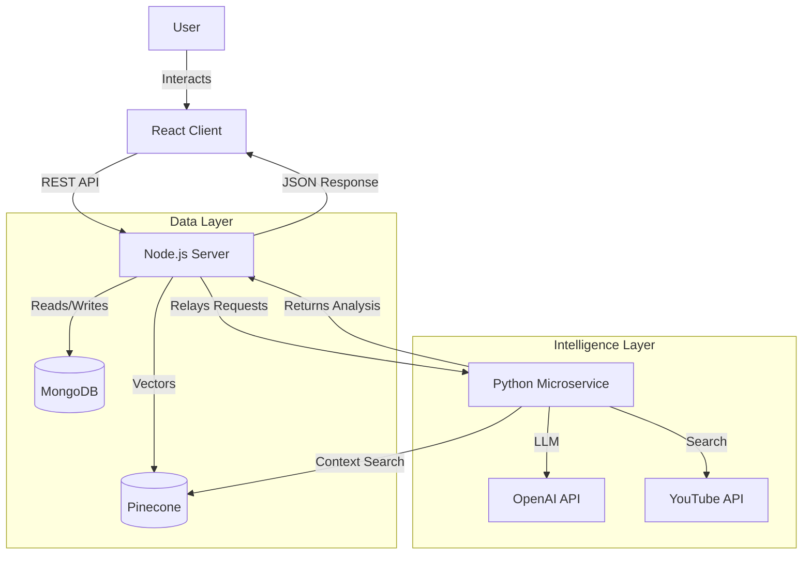

# StudyBuddy (Vortex) Project Summary

## 1. Overview

**StudyBuddy** (also referred to as **Vortex**) is an AI-powered educational platform designed to act as a personalized study companion for students. It leverages Retrieval Augmented Generation (RAG) to provide accurate, textbook-sourced answers and now includes intelligent video recommendations to supplement learning.

## 2. Technical Architecture

The project follows a **Microservices-lite** architecture:

- **Frontend**: Single Page Application (SPA) built with React & Vite.
- **Backend (Main)**: Node.js/Express REST API handling auth, data, and chat logic.
- **Backend (Intelligence)**: Python/FastAPI service for heavy ML tasks (RAG, Embeddings, Recommendations).
- **Database**: MongoDB (Primary Data) and Pinecone (Vector Data).

## 3. Tech Stack

| Component      | Technology               | Key Libraries                                                                                |
| -------------- | ------------------------ | -------------------------------------------------------------------------------------------- |
| **Frontend**   | React (TypeScript), Vite | `react-router-dom`, `tailwindcss`, `framer-motion`, `gsap`, `katex` (Math), `react-markdown` |
| **Backend**    | Node.js, Express         | `mongoose`, `passport` (Auth), `node-cron` (Automation), `multer`, `pdf-parse`               |
| **ML Service** | Python, FastAPI          | `scikit-learn` (TF-IDF), `pinecone-client`, `openai`, `google-api-python-client`             |
| **Database**   | MongoDB, Pinecone        | `mongoose`                                                                                   |
| **Infra**      | -                        | `dotenv` (Config), `nodemon`                                                                 |

## 4. Key Features

### 🎓 Intelligent Chat (RAG)

- **Contextual Answers**: Chatbot answers questions based _only_ on uploaded course materials (textbooks, PDFs), reducing hallucinations.
- **Vector Search**: Uses OpenAI embeddings and Pinecone to find relevant textbook chunks.
- **Math Support**: Renders complex mathematical formulas using LaTeX/KaTeX.

### 📺 Video Recommendations (New!)

- **Smart Suggestions**: Automatically suggests relevant YouTube tutorials for each syllabus topic.
- **Advanced Search**: Uses RAG to extract subtopics from the textbook to refine YouTube search queries (e.g., "Graph Theory" -> "Graph Theory BFS DFS implementation").
- **Caching**: Recommendations are cached in MongoDB and refreshed daily (12:00 AM IST) or on startup.

### 📂 Course & Content Management

- **PDF Parsing**: Robust pipeline to parse, chunk, and embed PDFs (including OCR for scanned docs).
- **Topic Extraction**: Automatically extracts and organizes topics from course materials.

### 🔐 Authentication & Security

- **OAuth & Local**: Google OAuth integration via Passport.js.
- **Session Management**: Secure session handling with MongoDB storage.

## 5. Recent Core Update: Video Recommendations

_Implemented Feb 2026_

- **Objective**: Supplement text answers with visual learning resources.
- **Implementation**:
  - Created `recommendationCacheService` in Node to manage data.
  - Built Python `recommender.py` for intelligent query generation.
  - Added automation via `node-cron` for background updates.
- **Status**: Fully functional. Gracefully handles API quota limits.

## 6. Future Roadmap (Suggested)

- **User Progress Tracking**: Analytics on topics studied and videos watched.
- **Interactive Quizzes**: Generate quizzes from the RAG context.
- **Mobile Responsiveness**: Further optimizations for mobile view.
